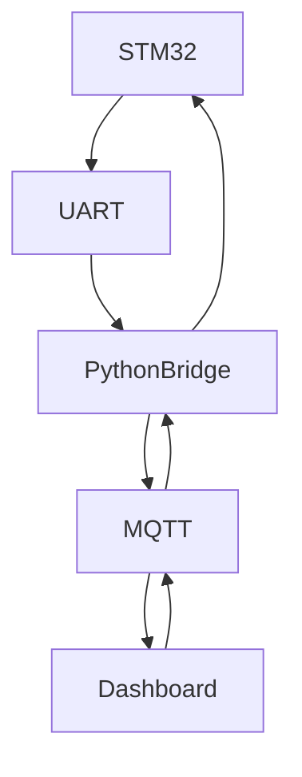

# SenseLink Firmware

> A FreeRTOS-based environmental monitoring system for STM32 featuring deterministic multitasking, custom embedded drivers and a complete IoT telemetry pipeline.


---

## Overview

SenseLink is a real-time embedded application developed for the **STM32 Nucleo-F030R8** using **FreeRTOS**.

The project demonstrates how to build a deterministic multitasking firmware on a resource-constrained microcontroller (**48 MHz Cortex-M0, 8 KB SRAM**) while extending it with a complete IoT monitoring pipeline.

The firmware periodically reads environmental data from a Bosch BME280 sensor, distributes measurements through FreeRTOS queues, updates a local LCD, manages an alarm state machine and streams telemetry over UART.

A lightweight Python gateway forwards telemetry to an MQTT broker, allowing a React dashboard to visualize the system in real time and remotely acknowledge alarms.

---

## Features

- FreeRTOS multitasking architecture
- Thread-safe communication using queues and mutexes
- Custom HD44780 LCD driver over PCF8574 (I²C)
- Bosch BME280 environmental monitoring
- UART telemetry with runtime CPU statistics
- Python UART ↔ MQTT bridge
- React monitoring dashboard
- Remote alarm reset
- Optimized memory usage for an STM32 with only **8 KB SRAM**

---

## Hardware

| Component | Description |
|------------|-------------|
| MCU | STM32 Nucleo-F030R8 (Cortex-M0, 48 MHz, 8 KB SRAM) |
| Sensor | Bosch BME280 |
| Display | HD44780 LCD + PCF8574 I²C expander |
| LEDs | Green, Yellow and Red status indicators |
| Communication | USART2 @ 38400 baud |

---

## System Overview

The firmware is built around four independent FreeRTOS tasks communicating through typed queues while shared peripherals are protected using mutexes.

The complete embedded architecture, task design and communication flow are documented in:

- 📄 **docs/freertos.md**
- 📄 **docs/architecture.md**

### End-to-End Pipeline



---

## Memory Optimization

Running FreeRTOS on a microcontroller with only **8 KB of SRAM** required careful tuning of:

- task stack sizes
- queue depths
- heap allocation
- runtime memory usage

A complete analysis of the memory budget and optimisation strategy is available in:

📄 **docs/memory.md**

---

## Project Structure

```text
SenseLink_Firmware/
│
├── Core/
├── docs/
├── SenseLink_Bridge/
├── senselink-dashboard/
└── README.md
```

---

## Getting Started

### Requirements

- STM32CubeIDE
- Python 3
- Node.js
- Mosquitto MQTT Broker

### Flash the firmware

Compile and flash the firmware using STM32CubeIDE.

### Start the bridge

```bash
cd SenseLink_Bridge
python bridge.py
```

### Start the dashboard

```bash
cd senselink-dashboard
npm install
npm run dev
```

---

## Dashboard

### Nominal


### Warning


### Critical


### UART Debug Output


---

## Engineering Challenges

| Challenge | Solution |
|------------|----------|
| Shared I²C bus contention | FreeRTOS mutex |
| Recursive mutex deadlock | Driver-level locking |
| SRAM limitations | Stack tuning and centralized formatting |
| LCD update latency | Queue sizing optimisation |
| Runtime profiling | FreeRTOS runtime statistics |

---

## Documentation

Additional implementation details are available in the **docs/** directory.

| Document | Description |
|----------|-------------|
| **architecture.md** | End-to-end system architecture and IoT pipeline |
| **freertos.md** | Task design, queues, mutexes and scheduler |
| **memory.md** | Heap, stack and RAM optimisation |
| **setup.md** | Build and project setup |

---

## Author

**Dimitry Ntofeu Nyatcha**

Embedded Systems & IoT Engineer

📧 ntofeunyatchadimitry@gmail.com
