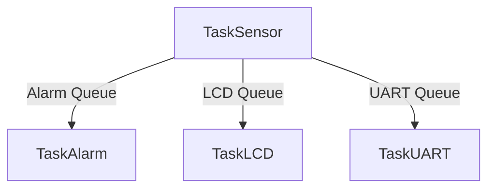

# SenseLink Firmware

> A **FreeRTOS-based embedded firmware** for the STM32 Nucleo-F030R8 demonstrating deterministic multitasking, inter-task communication and memory optimization on an **8 KB Cortex-M0**, extended with a lightweight IoT monitoring pipeline.


---

## Overview

SenseLink is an embedded systems project designed to demonstrate practical **FreeRTOS software engineering** on a resource-constrained microcontroller.

Running on an **STM32 Nucleo-F030R8 (48 MHz Cortex-M0, 8 KB SRAM)**, the firmware decomposes the application into independent real-time tasks responsible for sensor acquisition, alarm management, LCD updates and UART communication. Inter-task communication is handled exclusively through FreeRTOS queues, while shared peripherals are protected using mutexes to guarantee deterministic behaviour.

To make the embedded system observable in real time, the firmware is extended with a lightweight Python UART-to-MQTT gateway and a React dashboard that visualizes sensor telemetry, alarm status and runtime statistics.

---

## Technical Highlights

- **FreeRTOS-first architecture** with independent concurrent tasks
- **Queue-based communication** without shared global data
- **Mutex-protected I²C bus** for safe peripheral access
- **Custom HD44780 LCD driver** over a PCF8574 I²C expander
- **Memory optimization** for an MCU with only **8 KB SRAM**
- **Runtime CPU monitoring** using native FreeRTOS APIs
- **UART ↔ MQTT gateway** for live telemetry
- **React dashboard** for visualization and remote alarm reset

---

## Hardware

| Component | Description |
|------------|-------------|
| MCU | STM32 Nucleo-F030R8 (Cortex-M0 @ 48 MHz, 8 KB SRAM) |
| Sensor | Bosch BME280 |
| Display | HD44780 LCD + PCF8574 I²C expander |
| LEDs | Green, Yellow and Red status indicators |
| Communication | USART2 @ 38400 baud |

---

## System Overview

The firmware follows a modular multitasking architecture where each subsystem has a single responsibility.

Sensor acquisition, alarm evaluation, LCD updates and UART telemetry execute concurrently as independent FreeRTOS tasks. The embedded firmware is extended by a Python gateway that forwards telemetry to an MQTT broker, enabling real-time visualization from a React dashboard.

### Firmware Task Overview



For implementation details, see the technical documentation below.

---

## Technical Documentation

Detailed implementation notes are available in the **docs/** directory.

| Document | Description |
|----------|-------------|
| 📄 **[FreeRTOS Architecture](docs/freertos.md)** | Task responsibilities, queues, mutexes, scheduler design, runtime monitoring and engineering decisions. |
| 📄 **[System Architecture](docs/architecture.md)** | Complete end-to-end architecture from the STM32 firmware to the MQTT broker and React dashboard. |
| 📄 **[Memory Optimization](docs/memory.md)** | Heap allocation, task stack sizing, queue optimisation and SRAM budgeting. |
| 📄 **[Setup Guide](docs/setup.md)** | Build environment and project setup instructions. |

---

## Project Structure

```text
SenseLink_Firmware/
│
├── Core/
│
├── docs/
│   ├── architecture.md
│   ├── freertos.md
│   ├── memory.md
│   └── setup.md
│
├── SenseLink_Bridge/
│
├── senselink-dashboard/
│
└── README.md
```

---

## Getting Started

### Requirements

- STM32CubeIDE
- Python 3
- Node.js
- Mosquitto MQTT Broker

### 1. Flash the firmware

Build and flash the project using **STM32CubeIDE**.

### 2. Start the UART ↔ MQTT bridge

```bash
cd SenseLink_Bridge
python bridge.py
```

### 3. Launch the dashboard

```bash
cd senselink-dashboard
npm install
npm run dev
```

---

## Dashboard

The web interface provides real-time insight into the embedded system.

Features include:

- Live environmental measurements
- Alarm status visualization
- Runtime CPU usage
- Historical sensor charts
- Remote alarm acknowledgement

### Nominal


### Warning


### Critical


### UART Runtime Diagnostics


---

## Engineering Challenges

| Challenge | Engineering Solution |
|------------|----------------------|
| Shared I²C peripheral contention | Protected all transactions with a FreeRTOS mutex |
| Recursive mutex deadlocks | Restricted mutex ownership to the LCD driver layer |
| Limited SRAM (8 KB) | Optimized stack sizes, queue depths and heap usage |
| LCD update latency | Tuned queue sizing to absorb temporary I²C contention |
| Runtime profiling | Implemented FreeRTOS runtime statistics using native APIs |

---

## Author

**Dimitry Ntofeu Nyatcha**

Embedded Systems & IoT Engineer

📧 ntofeunyatchadimitry@gmail.com
