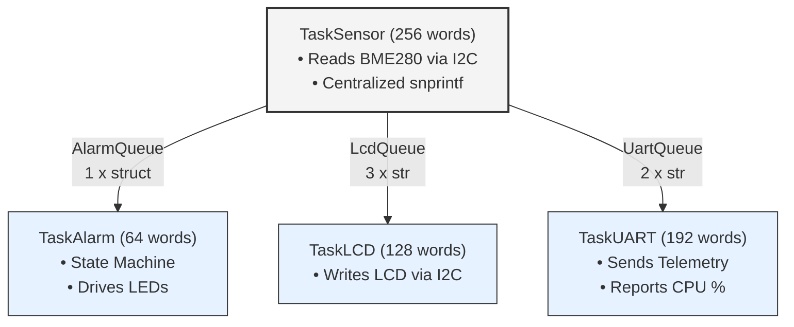
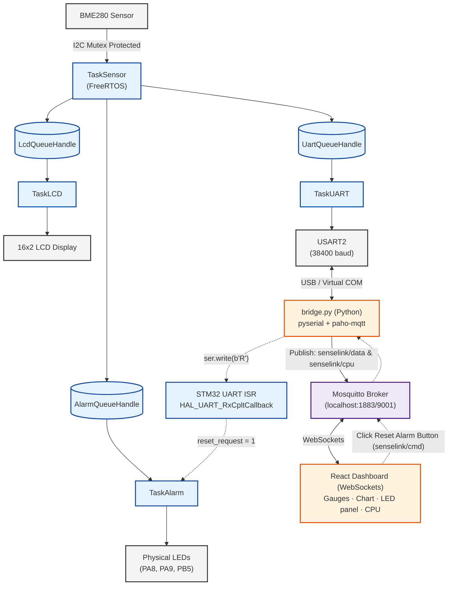

> A FreeRTOS multitasking firmware running on STM32,
> extended with an IoT monitoring pipeline.

---

## Table of Contents

- Project Overview
- Why FreeRTOS?
- Engineering Highlights
- Key Features
- System Architecture
- Hardware
- IoT Extension
- Project Structure
- Getting Started
- Engineering Challenges
- Documentation
  
---

## Project Overview

This project was built to demonstrate practical competency in **real-time
embedded software engineering** on a resource-constrained microcontroller.
The primary goal was to architect a correct, stable FreeRTOS multitasking
application on a device with only **8 KB of RAM**, then extend it with a
full IoT stack to visualise and interact with the running system in real time.

Every design decision in the firmware: task stack sizes, queue depths,
mutex placement, ISR design , was driven by the constraints of FreeRTOS
running on the STM32F030R8.

---

## Why FreeRTOS?

This project was intentionally designed around **FreeRTOS** to demonstrate the
development of a real-time embedded application rather than a simple
super-loop firmware.

Instead of sequentially polling peripherals inside an infinite loop, the
system is decomposed into independent tasks dedicated to sensing, alarm
management, LCD updates and UART communication. FreeRTOS provides the
scheduling, synchronization and communication mechanisms required to keep
these activities deterministic and maintainable.

The objective was not simply to "use FreeRTOS", but to apply its core
concepts in a realistic resource-constrained environment by designing a
thread-safe architecture based on tasks, queues, mutexes and interrupt-driven
events on a microcontroller with only **8 KB of RAM**.

---

## Engineering Highlights

- **FreeRTOS-First Architecture**  
  Designed around independent tasks communicating exclusively through typed FreeRTOS queues, eliminating the need for global variables and ensuring thread-safe communication.

- **Custom Bare-Metal LCD Driver**  
  Developed a complete HD44780 4-bit LCD driver over an I2C PCF8574 expander without relying on external high-level libraries.

- **Resource-Constrained Design**  
  Carefully optimized task stack sizes, queue depths and heap usage to run reliably on an STM32F030R8 with only **8 KB of RAM**.

- **Runtime System Monitoring**  
  Implemented per-task CPU usage statistics and UART telemetry to observe scheduler behaviour and runtime performance.

- **Complete IoT Integration**  
  Extended the embedded firmware with a Python UART-to-MQTT bridge and a React dashboard for real-time visualization and remote alarm control.

---

## Key Features

### FreeRTOS Architecture

- Four concurrent FreeRTOS tasks with clearly defined responsibilities.
- Thread-safe inter-task communication using typed message queues.
- Shared I2C bus protection through a FreeRTOS mutex.
- Interrupt-driven UART communication using ISR-to-task signalling.
- Runtime CPU usage monitoring with FreeRTOS task statistics.
- Memory optimisation for an STM32F030R8 with only **8 KB of RAM**.
- Latching alarm state machine implemented as an independent FreeRTOS task.

### Embedded Software

- Custom HD44780 LCD driver over an I2C PCF8574 expander.
- Shared I2C bus for the BME280 sensor and LCD display.
- Interrupt-driven UART communication with error recovery.
- STM32 HAL peripheral configuration (GPIO, I2C, USART and TIM).

### IoT Integration

- Python UART-to-MQTT bridge for bidirectional communication.
- React dashboard with real-time MQTT telemetry.
- Remote alarm reset from the dashboard to the STM32 firmware.

---

## Hardware

| Component | Details |
|---|---|
| Microcontroller | STM32 Nucleo-F030R8 (Cortex-M0, 48 MHz, **8 KB RAM**) |
| Sensor | Bosch BME280 -> temperature, humidity, pressure via I2C |
| Display | 16x2 HD44780 LCD via PCF8574 I2C expander (0x27) |
| Green LED | PA9 -> Nominal alarm state |
| Yellow LED | PA8 -> Warning alarm state |
| Red LED | PB5 -> Critical alarm state (blinking) |
| UART | USART2 at 38400 baud via ST-Link USB |

**Wiring note:** The BME280 and the PCF8574 LCD expander share I2C1 (PB6/PB7).
Bus contention between tasks is prevented by a FreeRTOS mutex.

---

## System Architecture

The firmware is organised around four independent FreeRTOS tasks, each
responsible for a single function of the system. Communication between
tasks is performed exclusively through typed FreeRTOS queues, while access
to shared peripherals is synchronised using a mutex.

This architecture eliminates global-variable based communication, enforces
a clear separation of concerns and keeps the firmware deterministic,
maintainable and easy to extend.

### Task Design



| Task | Stack | Role |
|---|---|---|
| **TaskSensor** | 256 words | Reads the BME280 every 2 seconds, formats telemetry once using `snprintf`, then dispatches data to the three consumer tasks. |
| **TaskLCD** | 128 words | Receives pre-formatted strings and updates the LCD display. |
| **TaskUART** | 192 words | Sends telemetry over UART and periodically reports per-task CPU usage. |
| **TaskAlarm** | 64 words | Evaluates sensor thresholds, manages the latching alarm state machine and drives the LEDs. |
| **IDLE** | 128 words | FreeRTOS idle task. Typical CPU usage: ~98%. |

### Thread-Safe Communication

Tasks communicate exclusively through typed FreeRTOS queues, eliminating
global-variable based data sharing and ensuring thread-safe communication.

> Detailed queue implementation is documented in `docs/freertos.md`.

### Shared Resource Protection

The BME280 sensor and the HD44780 LCD share the same I2C peripheral.
A FreeRTOS mutex guarantees exclusive access to the bus, preventing
concurrent transactions and ensuring reliable communication.

> Detailed mutex implementation is documented in `docs/freertos.md`.

## Alarm State Machine

`TaskAlarm` implements a three-state latching alarm state machine:

- **Nominal**
- **Warning**
- **Critical (latched until reset)**

The alarm logic is fully isolated inside its own FreeRTOS task, making it
independent from sensor acquisition and user interface updates.

> Detailed state transitions are documented in `docs/freertos.md`.

## Runtime CPU Monitoring

`TaskUART` periodically collects FreeRTOS runtime statistics using
`uxTaskGetSystemState()` and transmits the results over UART.

The Python bridge forwards these statistics via MQTT, allowing the React
dashboard to display per-task CPU usage in real time.

### Example UART Output

```
--- CPU USE ---
TaskUART     : <1%
TaskLCD      : 0%
IDLE         : 98%
TaskAlarm    : <1%
TaskSensor   : <1%
---------------
```
### PuTTY UART Debug Output


## Memory Optimisation

One of the main engineering constraints of this project was running a
multitasking FreeRTOS application on a microcontroller with only **8 KB of RAM**.

Task stack sizes, queue depths and heap allocation were carefully optimised
to ensure stable operation within the available memory budget.

> Detailed memory analysis is documented in `docs/memory.md`.

## IoT Extension

Although the primary objective of this project was to design a robust
FreeRTOS application, the firmware was extended into a complete IoT
monitoring system.

A lightweight Python bridge forwards telemetry from the STM32 over UART to
an MQTT broker, allowing a React dashboard to display live sensor data,
system status and FreeRTOS runtime statistics. The dashboard can also send
commands back to the firmware, including remote alarm reset.



## Project Structure

```
SenseLink_Firmware/
├── Core/
│   ├── Inc/
│   │   ├── alarm_task.h       # LED pin definitions, alarm task declaration
│   │   ├── bme280_task.h      # Sensor task declaration
│   │   ├── lcd_i2c.h          # LCD driver API [Custom Implementation]
│   │   ├── lcd_task.h         # LCD task declaration
│   │   ├── queues.h           # FreeRTOS queue handle declarations
│   │   ├── sensor_data.h      # Shared structs (SensorData_t, FormattedData_t)
│   │   ├── uart_task.h        # UART task declaration
│   │   └── FreeRTOSConfig.h   # Heap, tick rate, runtime stats config
│   └── Src/
│       ├── alarm_task.c       # Latching alarm state machine + LED control
│       ├── bme280_task.c      # Sensor acquisition + centralised formatting
│       ├── lcd_i2c.c          # HD44780 4-bit driver via PCF8574 [Custom Implementation]
│       ├── lcd_task.c         # LCD display consumer task
│       ├── queues.c           # Queue handle definitions
│       ├── uart_task.c        # UART telemetry + CPU stats reporter
│       └── main.c             # Peripheral init, queues, tasks, ISR callbacks
│
├── SenseLink_Bridge/
│   ├── bridge.py              # Bidirectional UART <-> MQTT bridge
│   └── .gitignore             # Excludes venv/
│
└── senselink-dashboard/
    ├── src/
    │   ├── App.jsx            # Root: MQTT client, state, component composition
    │   ├── App.css            # Global CSS variables and shell layout
    │   ├── constants/config.jsx # Thresholds, MQTT URLs, alarm config
    │   ├── hooks/useUptime.jsx  # Live uptime counter custom hook
    │   └── components/
    │       ├── Sidebar/        # Connection, alarm badge, event log, reset button
    │       ├── Gauges/         # SVG semi-circular gauges, pressure bar
    │       ├── Chart/          # Recharts area chart (last 20 readings)
    │       └── BottomRow/      # Hardware LEDs, system info, CPU task monitor
    └── package.json
```

---

## Getting Started

### Prerequisites

- STM32CubeIDE
- Python 3.x
- Node.js 18+
- Mosquitto MQTT Broker


### 1. Flash the Firmware

Build and flash the firmware to the STM32 Nucleo-F030R8 using STM32CubeIDE.

### 2. Start the MQTT Broker

Start the Mosquitto broker with WebSocket support enabled.

### 3. Launch the Python Bridge

```bash
cd SenseLink_Bridge
python bridge.py
```

### 4. Start the React Dashboard

```bash
cd senselink-dashboard
npm install
npm run dev
```

## Expected Result

### Nominal state


### Warning state


### Critical state


### Demonstration Video

https://github.com/user-attachments/assets/5a87f34f-4455-497a-9637-b3505b58a1ff


---

## Key Engineering Challenges

| Challenge | Solution |
|---|---|
| I2C bus conflict between LCD and BME280 | FreeRTOS mutex + 3 s startup delay in TaskSensor |
| Mutex deadlock (re-entrant acquisition) | Moved mutex to `LCD_SendCommand` level only |
| Heap exhaustion on 8 KB device | Tuned stack sizes, centralised snprintf, heap set to 3972 bytes |
| LCD display corruption | Increased LCD queue depth from 2 to 3 |
| CPU stats buffer overflow after removing a task | Runtime `uxTaskGetNumberOfTasks()` guard |
| CPU stats showing 100% on all tasks | Replaced TIM3 (overflowed every 65 ms) with `xTaskGetTickCount()` |

## Documentation

Detailed implementation notes will be available in the `docs/` directory.

## Author

**Dimitry Ntofeu Nyatcha**  

Email: ntofeunyatchadimitry@gmail.com

Suggestions, feedback, and collaboration ideas are welcome.
