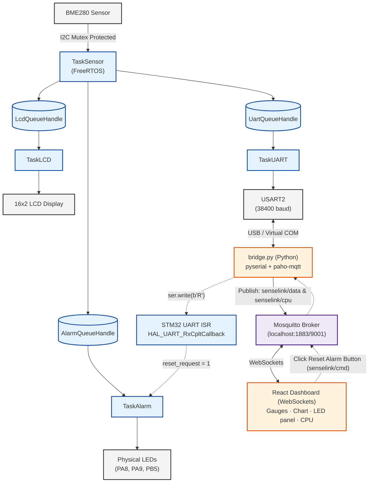

# System Architecture

This document describes the complete SenseLink system architecture, from sensor acquisition on the STM32 to real-time visualisation in the web dashboard.

---

# Architecture Overview

SenseLink is composed of four independent layers:

1. Embedded Firmware (STM32 + FreeRTOS)
2. UART Communication
3. MQTT Gateway
4. React Dashboard

Each layer has a well-defined responsibility and communicates only through clearly defined interfaces.

---

# Embedded Layer

The embedded firmware runs on an STM32F030R8 microcontroller using FreeRTOS.

The firmware is responsible for:

* Reading environmental data from the BME280 sensor.
* Evaluating alarm conditions.
* Updating the LCD display.
* Streaming telemetry over UART.
* Receiving remote commands.

Communication between tasks is entirely handled through FreeRTOS queues.

---

# UART Layer

`TaskUART` periodically transmits telemetry over USART2.

Typical messages include:

* Temperature
* Humidity
* Pressure
* Alarm state
* CPU statistics

Incoming UART data is handled through interrupts using `HAL_UART_RxCpltCallback()`.

The only command currently implemented is:

```text
R
```

which resets the latched alarm state.

---

# Python Bridge

The Python bridge acts as a gateway between the embedded firmware and the MQTT broker.

Its responsibilities are:

* Read UART telemetry.
* Parse incoming messages.
* Publish JSON payloads to MQTT.
* Receive MQTT commands.
* Forward commands back to the STM32 through UART.

This component completely decouples the firmware from the networking stack.

---

# MQTT Layer

Mosquitto is used as the MQTT broker.

Example topics:

| Topic            | Description                 |
| ---------------- | --------------------------- |
| `senselink/data` | Environmental telemetry     |
| `senselink/cpu`  | FreeRTOS runtime statistics |
| `senselink/cmd`  | Dashboard commands          |

The dashboard communicates with the broker through WebSockets.

---

# React Dashboard

The dashboard subscribes to MQTT topics and displays:

* Live sensor values
* Alarm status
* Hardware LEDs
* Runtime CPU usage
* Historical measurements

It also allows the user to remotely reset the alarm.

---

# End-to-End System Architecture

The following diagram illustrates the complete SenseLink architecture,
from sensor acquisition on the STM32 to real-time visualization on the
dashboard, including the return path used to remotely reset the alarm.




# Design Principles

The architecture was designed around the following principles:

* Separation of concerns
* Loose coupling between software layers
* Thread-safe communication
* Modular design
* Extensibility

Because each subsystem has a single responsibility, new sensors, dashboard features or communication protocols can be added with minimal impact on the rest of the system.
